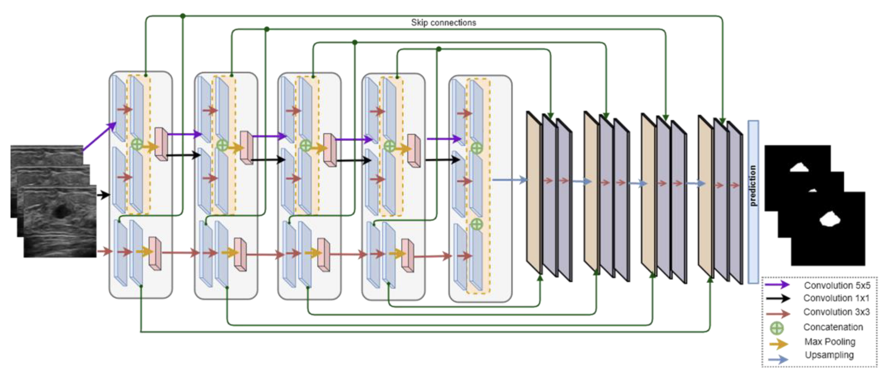

## Description


This is an unofficial implementation of STAN architecture: https://arxiv.org/ftp/arxiv/papers/2002/2002.01034.pdf

## Installation

Instructions on how to install and set up the project.
- Clone the repository: 'https://github.com/JaouadT/STAN_implementation_pytorch.git'.
- cd into the repository: cd STAN_implementation_pytorch.
- pip install -r requirements.txt
- Download BUSI dataset: https://academictorrents.com/details/d0b7b7ae40610bbeaea385aeb51658f527c86a16.

## Usage
Instructions on how to use the project and any relevant examples.
- The script uses a 5 fold cross validation, split the data or reach out for the splitted data and put it inside a 'data' folder.
```bash
├── data
│   ├── test
│   │   ├── images
│   │   │   ├── benign (1).png
│   │   ├── masks
│   │   │   ├── benign (1).png
│   └── train
│   │       ├── split0
│   │       │   ├── images
│   │       │   ├── masks
│   │       ├── split1
│   │       ├── split2
│   │       ├── split3
│   │       ├── split4
```
- Run the script main.py


## Original paper
Shareef, Bryar et al. “Stan: Small Tumor-Aware Network for Breast Ultrasound Image Segmentation.” 2020 IEEE 17th International Symposium on Biomedical Imaging (ISBI) (2020): 1-5. https://doi.org/10.1109/ISBI45749.2020.9098691
